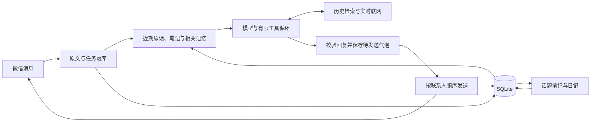

# ATRI 2.0 实现设计

状态：已实现；2026-09-14。本文描述当前代码，替代重构前的 v0.2 讨论稿。使用方法见 [部署说明](deployment.md)，已完成和待完成的验证见 [验证记录](validation.md)。

## 边界与模块

一个 Node.js 24 应用进程通过 Docker Compose 部署，使用本地 SQLite WAL。微信私聊为主要入口，面向单个陪伴角色；不同联系人各自保存经历，不共享记忆。管理页的本地试聊也独立保存。

| 模块           | 职责                                                       |
| -------------- | ---------------------------------------------------------- |
| apps/api       | Fastify 管理接口、静态管理页、配置、微信适配与进程生命周期 |
| packages/core  | 对话循环、上下文、信息工具、日记、话题笔记和主动联系       |
| packages/ilink | 扫码、长轮询、协议、加解密和媒体收发                       |
| packages/llm   | OpenAI 兼容、Anthropic、Gemini 请求与工具续接              |
| packages/db    | 原始消息、持久任务、投递记录、记忆、日记、检索和备份       |

不再运行 Android、Worker、Redis、向量服务、多节点协调或多角色平台。旧数据不迁移，旧版本保留在 Git 历史中。

## 一次对话

输入与任务在同一个短事务保存，可靠保存后推进微信游标。同一联系人串行处理，默认 800 毫秒内的连发合并成一轮；各条原文独立保存。不同联系人最多同时处理三个。

普通回复通常只调用一次模型。需要信息时，最多两轮工具调用、四次工具执行；含一次可选格式修复在内，最多四次模型生成。单轮总时限默认 90 秒，单次模型请求默认 45 秒。每次成功的模型调用记录 token 数与耗时。

工具仅有 search_memory、read_history、web_search、open_page。模型读资料、提出回复与记忆更新，代码限定联系人范围、校验依据并执行写入。没有自由执行脚本、任意文件读写或修改系统配置的模型工具。

回复是有序的 messages 数组，文字和目录内的表情可以混排。代码保存全部气泡后逐个发送。无效表情不会变成原始协议文本发给用户。

## 人物与情绪

四份提示词分别管理 persona、chat、diary、context_notes。管理页可以修改人物设定；其他行为规则集中在 shared/prompts。

情绪和关系表达来自人物基础、当前对话、记忆与日记。没有情绪数值、好感度、情绪衰减、独立自我模型或定时心理活动。首次使用不预设共同经历或恋爱关系。

日记是第一人称回看。可以表达感受与不确定的理解，但不能为离线时间虚构见闻，也不能把角色的推测升级成用户明确说过的事实。

## 记忆分工

| 数据         | 用途                                                           |
| ------------ | -------------------------------------------------------------- |
| 原始对话     | 保存说话人、原文、时间、附件引用和已发送内容，作为可核对的依据 |
| 当前话题笔记 | 保留长对话中的指代、纠正和未完事项，减少反复塞入完整历史       |
| 长期记忆     | 带来源的偏好、事实、约定和主观理解                             |
| 日记段落     | 回看真实经历及感受，同时参与后续检索                           |

默认模型窗口配置为 65,536 token，每次模型请求的输入预算为 24,000，输出上限为 3,000，并保留 1,024 token 协议余量。这些值可以在网页“调试与设置”直接修改；窗口需要按提供商说明填写，程序不会自动识别模型的真实容量。输入、输出和余量之和不能超过窗口，非法修改不会写入。

计数采用跨提供商的保守估算：ASCII 按约 3 个字符一个 token，其他 Unicode 字符按每个 2 token，图片按每张 4,096 token 估算；还计入工具定义、消息和续传内容。它不是模型专用 tokenizer，不能保证实际用量完全一致。调试页单独显示供应商返回的输入、输出用量与耗时；接口未报告用量时记录为 0。

近期原话优先保留，再放入有限长度的笔记、少量近期认识和自动相关召回。初始输入尽量为工具续接留出最多 6,000 token；工具结果也限制在剩余预算中。每次请求前再次检查估算用量。最新原话和必要提示词本身超限时，保留原文并报错，管理员可增加预算或缩短人物设定、消息后重试。日记和话题整理同样受输入预算约束，日记的生成上限也不会突破网页设置。

未整理原文接近预算或达到近期记录窗口时，才创建话题笔记任务。整理保留原始记录；模型可用检索和来源 ID 找回较早的内容。

检索使用 SQLite FTS5 trigram 和中文子串匹配，结果带时间、类型、说话人及可继续读取的来源。明确纠正可替代旧记忆；被替代的条目退出默认召回。关键词重合有助于找回换一种表述的经历，完全没有词面重合的语义召回仍有局限。

日记在使用者时区的指定小时之后增量处理此前日期的新消息，默认凌晨 3 点。较长的一天分批整理；手动“整理日记”也可纳入今天的消息。每段必须引用本批原文，没有值得写的内容时可以为空。

这不是模型权重学习，也没有实现 DeepSeek Engram 结构或调用 Codex 专用上下文压缩接口。借鉴的是“小循环、有限上下文、可检索历史、按需读取”的工作方式。

## 确定的数据规则

- 所有来源、历史和检索查询都限定在当前联系人。
- stated 需要对话原文依据；interpretation 保留主观理解的身份。日记来源不能直接写成 stated。
- 检索保留 user 与 assistant，避免把角色自己的发言记成对方的偏好。
- 未确认发送的角色发言不进入历史索引，不能作为已发生的承诺被引用。
- 相同内容与来源重复写入时保持幂等，记忆不能把另一条记忆当作新的证据。
- 新消息或管理更正会更新联系人版本。旧草稿提交时作废；后台任务中的旧认识不能覆盖新更正。
- 管理更正添加一条明确标识的修正记录，并原子替代旧认识、清空旧话题笔记。
- 删除原文会使依赖它的日记和记忆失效，并清理笔记与检索索引，处理范围覆盖全部历史。
- 删除记忆不会删除对应原文；若要忘记整段经历，需要删除原文。既有备份和微信已送达消息不受管理页删除操作影响。

这些规则保证来源和写入一致性。模型是否准确理解来源、是否自然使用记忆，仍需实际模型场景评估。

## 消息可靠性

使用协议稳定 ID；缺少 ID 时由发送方、时间、正文及媒体生成指纹。没有稳定 ID 或时间的事件使用批次游标和位置回退，这种协议输入下无法保证跨批次严格去重。

任务与发送状态持久保存。新输入使尚未发送的旧草稿失效；已经发送的气泡保留，后续按已确认状态继续。已确认气泡不会重新生成并重发。

发送失败与送达不明分别记录。服务重启遇到“发送中”时改为“送达不明”，暂停该联系人的队列。管理页显示联系人、原消息和错误，允许确认已收到、重发或跳过。重试沿用同一个 client_id，但微信端是否严格去重由协议能力决定。

备份恢复也会暂停历史任务和未确认投递。应用按单实例运行，共享同一数据库启动多个应用实例不在支持范围内。

## 微信与联网

ilink 源码和原测试来自 WeChat-AI 的 cf8fbec，保留来源许可。应用层重新实现队列、管理、SQLite 和日记记忆逻辑。

表情通过图片发送，包含五张基础素材，也可上传自有图片。支持视觉的模型可读取最近的图片，画面描述以“模型观察”标识并进入后续检索。未启用视觉或附件不可读时不假装看到图片。语音仅利用接口自带转写。

Tavily 搜索返回链接、查询时间及可获得的发布时间。open_page 校验公开 HTTP/HTTPS 地址、DNS 结果及重定向，限制响应长度；动态网页和受访问限制页面可能无法读取。网页与历史均作为资料，不能改变工具权限或联系人范围。

主动联系默认关闭。开启后，至少沉默指定小时、处于安静时段外才尝试；每天最多一次尝试且与上次主动发送至少相隔 12 小时。使用同一对话和投递流程，模型没有自然话题时可以跳过。

## 运维

服务提供 /healthz 与密码保护的管理接口。管理登录使用 HttpOnly、SameSite Cookie；部署为 HTTPS 时开启 Secure Cookie。模型和搜索密钥不在管理 API 中回显。账号会话、已保存的模型配置和聊天内容位于数据卷，应一起备份并限制访问。

Docker 镜像内只有应用与静态资源，默认数据卷挂载到 /data。备份使用 SQLite 一致快照，包含被引用的媒体、自定义表情和文件校验清单。恢复必须指向空数据目录，避免覆盖现有实例。
